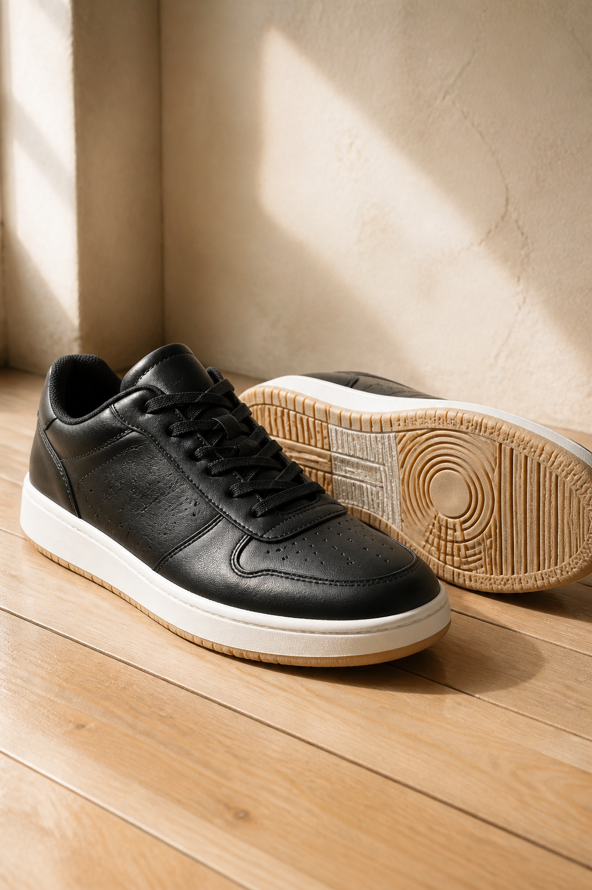
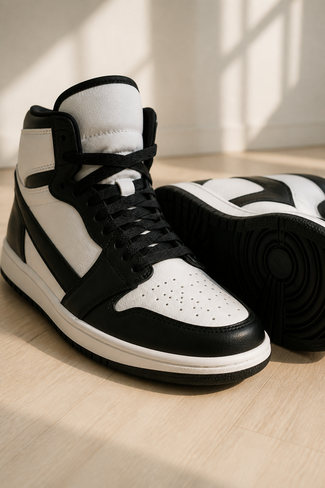
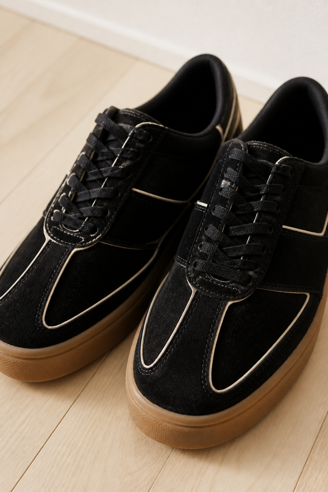
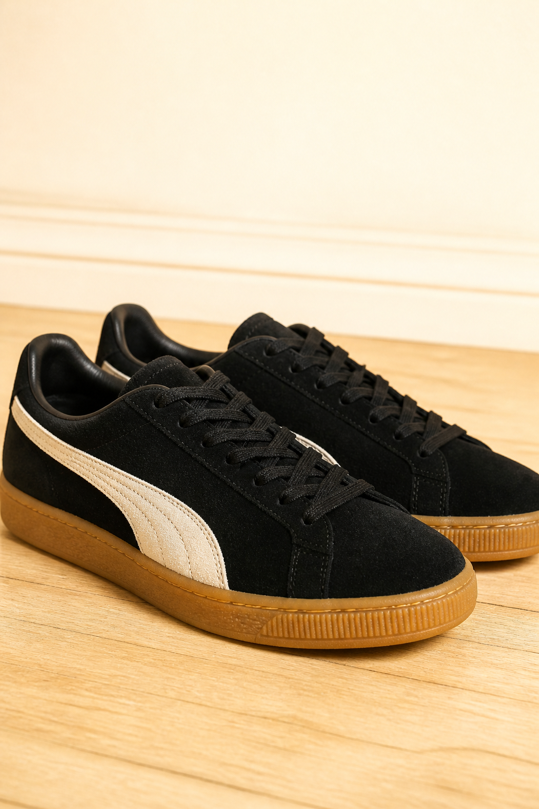
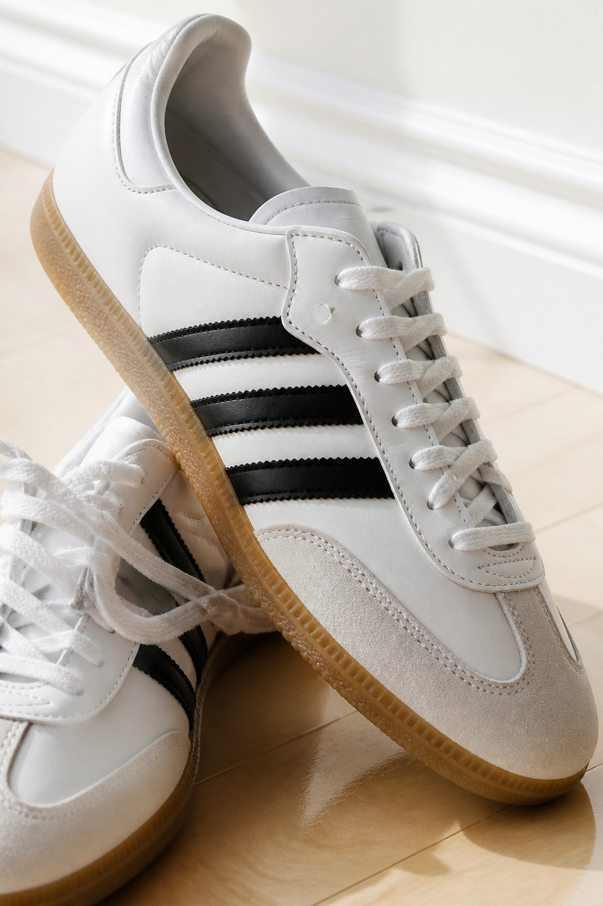
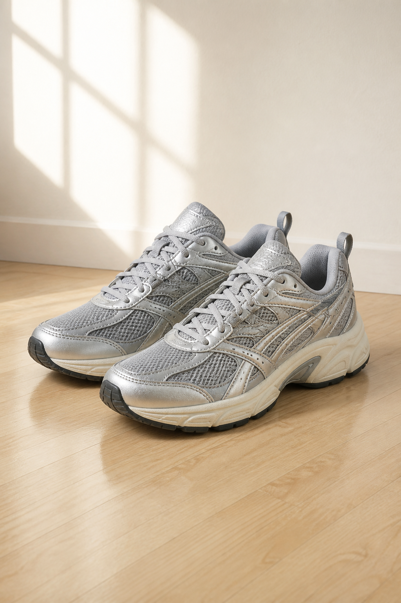
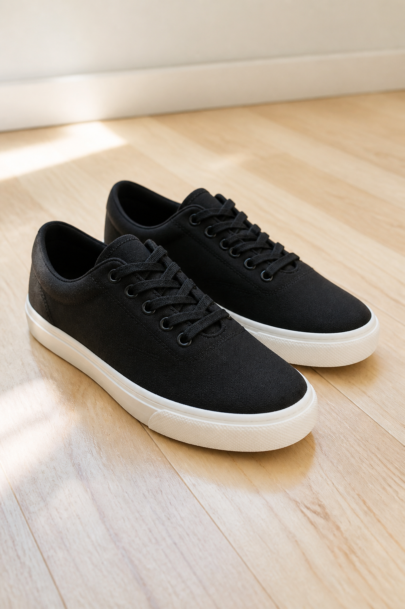

# 街舞鞋测评 · 批量导入正文（7 条）

分类一律填：`穿搭`  
封面图放：`server/data/uploads/`（文件名见每条）  
作者建议：`穿搭研究局`　城市：`上海`　置顶：`否`  
标签列用分号。正文单元格内空行分段（Excel：Mac 用 Option+Command+Enter）。

小红书发图文时：标题用「平台标题」，正文用「正文」，图用对应 jpg，话题从标签改成 `#`。

---

## 1 Nike AF1 Dance

- 封面图URL：`nike-af1-dance.jpg`
- 平台标题：街舞鞋 AF1 Dance 真的轻
- 副标题：Hip-hop / 编舞脚部元素
- 标签：街舞鞋;AF1 Dance;hiphop鞋子;跳舞鞋子;编舞;练舞日常;街舞穿搭;战鞋

### 正文

课上有人穿完 AF1 Dance，自己那双普通空军就搁角落一周没动。

街舞鞋圈里这双被叫得很多。不是那种「看起来像舞鞋」，是脚尖、脚跟、slide 真的顺。

## 舞种

Hip-hop、编舞里带脚部元素的课。想把地板蹭清楚的人更合适。

## 上脚

轻、软。软底不是塌，底下还有一点支撑，蹲下去不会晃成一摊。

唯一烦的是闷。夏天连上两节，鞋子自己会说话。

## 别跟经典空军搞混

经典 AF1 抓地、耐脏、人人一双。

但这双更像专门拿来跳舞的：底薄一点、脚更跟。经典那双厚、重，大幅度容易发虚。

你现在主力是普通空军还是 Dunk？评论区报一下，我按课表帮你对一下该不该换。

关注我，下一双写 Dunk 转圈到底滑不滑。

---

## 2 Nike Dunk

- 封面图URL：`nike-dunk.jpg`
- 平台标题：街舞鞋 Dunk 转圈比空军顺
- 副标题：Hip-hop 转圈 / 跟脚
- 标签：街舞鞋;Nike Dunk;hiphop;转圈;熊猫dunk;跳舞鞋子;街舞日常;板鞋

### 正文

黑怕课上转圈转不动，十有八九是鞋底咬死了。

街舞鞋里 Dunk 被提起的次数，几乎跟空军打平。有人说它跟长在脚上一样。

## 舞种

Hip-hop。转圈、跟脚、蹲下去还想稳住的那种课。

## 上脚

GS 那双底相对软一点，日常练也能穿出门。

熊猫 Dunk 好看，鞋底偏硬。硬不是不能跳，是跳久了脚底板会提意见。

## 跟空军怎么选

空军厚、稳、耐脏。Dunk 更贴、好转圈。

大幅度黑怕、老觉得空军要崴的人，很多人最后滑去 Dunk。

你转圈更怕滑还是更怕转不动？留一个字，我按你的地板说该穿哪双。

关注我，后面写平价 T 字头，两百内能不能顶。

---

## 3 吉鲁克 Gearock T 字头

- 封面图URL：`gearock-t.jpg`
- 平台标题：街舞鞋吉鲁克T字头能暴跳
- 副标题：Hip-hop 练功 / 平价板鞋
- 标签：街舞鞋;吉鲁克;Gearock;平价舞鞋;滑板鞋;hiphop;练舞日常;T字头

### 正文

不想一上来就砸 Dunk，又想要 T 字头那种贴地，吉鲁克挺常被翻出来。

本来是滑板鞋。拿到舞室才发现，暴跳一晚上也还跟脚。

## 舞种

Hip-hop、日常练功。出街也能穿，不用单独备一双「只给跳舞」。

## 上脚

新鞋会硬。别第一周就嫌弃，穿开了才跟脚。

黑色绒面没那么显脏。小白那双鞋垫更软，浅色会脏得很快，打理是真烦。

两百内能拿下。脏了不心疼，这点比空军实在。

## 别指望它当气垫

没有厚气垫护膝。膝盖已经哼哼的人，别拿它当减震方案。

你能接受翻毛皮难洗吗？能的话这双性价比很凶。不能的话去看 Dunk。

关注我，下一双写 Puma Suede，breaking 的人为什么老推它。

---

## 4 Puma Suede

- 封面图URL：`puma-suede.jpg`
- 平台标题：街舞鞋Suede breaking更爱
- 副标题：Breaking 首推 / Hip-hop 次选
- 标签：街舞鞋;Puma Suede;breaking;地板舞;hiphop鞋子;绒面;练舞;战鞋

### 正文

跳地板的人点名 Suede，频率比跳黑怕的人高一截。

绒面、胶底、包脚。不是新款，是穿过才知道为什么一直没被换掉。

## 舞种

Breaking 更合适。Hip-hop 能穿，但不是黑怕课上的唯一答案。

## 上脚

软、裹得住。全黑全灰那天，它往脚上一套就完事。

翻毛皮怕水、怕脏。家用洗鞋机我不敢扔，洗毁了真的心疼。

有人说脚步多的时候鞋头撕不动、转圈也涩。鞋尖磨平是正常的，不是你动作做错了。

## 跟 Dunk 怎么分

要转圈、要跟脚：Dunk。

要贴地、要地板：Suede。

你主项是 breaking 还是 hiphop？回一个，我直接告诉你别买错。

关注我，下一双写 Samba，贴地爽完为什么脚会酸。

---

## 5 Adidas Samba

- 封面图URL：`adidas-samba.jpg`
- 平台标题：街舞鞋Samba贴地但别当第一双
- 副标题：Hip-hop 贴地 / step
- 标签：街舞鞋;Samba;德训鞋;hiphop;贴地;练舞鞋子;街舞穿搭;新手避坑

### 正文

Samba 底薄、软、贴。脚跟脚尖一蹭，step 看起来会更清楚。

问题也在这层薄上。

## 舞种

Hip-hop 里讲究贴地、指向的课。

业余小白拿它当第一双战鞋，转圈容易发虚。上完一堂，足弓会提意见。

## 上脚

胶底很轻。不是气垫那种「把你托起来」，是你自己在地板上。

绒面脏了难看，挑衣服。姜黄那种配色更挑。

德训平替（森果果那种）底包得更高、好转圈，但闷，连刷课会热。

## 一句话

贴地爽，不等于能撑完整节课。

你现在跳了多久？三个月内我更建议 Dunk 或 AF1 Dance，Samba 当第二双。

关注我，下一双写 P-6000，膝盖哼哼的人再看。

---

## 6 Nike P-6000

- 封面图URL：`nike-p6000.jpg`
- 平台标题：街舞鞋P6000减震但不够跟
- 副标题：编舞 / Hip-hop 护膝向
- 标签：街舞鞋;P6000;气垫鞋;减震;编舞;hiphop;膝盖;跳舞鞋子

### 正文

膝盖已经开始哼的人，评论区老是把 P-6000 和黑空军、Shox 扔在一起问。

它是跑鞋那条线上的。气垫有，抓地和跟脚不是 Dunk 那种。

## 舞种

编舞、Hip-hop 里蹦跳多、在意缓冲的课。

不是转圈课的第一选择。

## 上脚

减震比薄底板鞋明显。连跳对膝盖会客气一点。

底比 Samba 厚，贴地感会差一截。有人觉得稳，有人觉得「垫起来了，下不去」。

宽脚要试。前掌挤就大半码，别硬塞。

## 别跟 Shox 混

R4 出片、柱子高，垫脚不稳，技术课很多人劝退。

要减震又想少崴，P-6000 比 R4 好说话。要跟脚转圈，还是 Dunk。

你膝盖现在是隐隐作痛，还是只是跳完酸？回一下，别盲目上厚气垫。

关注我，最后一双写特步，便宜新鞋为啥后面会滑。

---

## 7 特步轻板鞋

- 封面图URL：`xtep-board.jpg`
- 平台标题：街舞鞋特步新鞋轻旧了滑
- 副标题：入门能凑 / Jazz 穿开劝退
- 标签：街舞鞋;特步;平价舞鞋;jazz;hiphop;滑不滑;练舞避坑;板鞋

### 正文

刚入坑想买双便宜的练脏，特步会被反复点名。

新鞋：轻、跟脚、Jazz / Hip-hop / Afro 都能先穿上。脏了不心疼。

穿开之后是另一双鞋。

## 舞种

新鞋阶段：Jazz、Hip-hop、Afro 都能应急。

鞋底磨滑以后，Jazz 基本功最危险。热身站桩都要抠地。有人滑回 Dunk，不敢再上爵士。

## 上脚

第一周你会觉得捡到了。第三周地板开始跟你作对。

不是鞋码的问题，是橡胶磨光了。

## 怎么买才不亏

当「练脏鞋」「雨天备用」可以。

当唯一战鞋，尤其爵士课，过两周你就会骂自己。

你现在那双特步，新的还是已经发亮了？发亮了就别硬穿，换 Dunk 或吉鲁克。

关注我，这 7 双我按红黄黑排过，下条把对照表贴出来。
